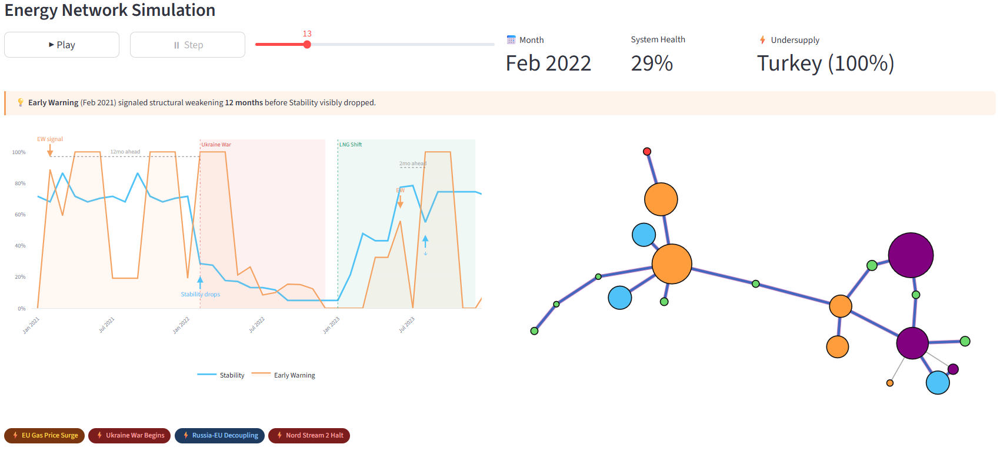

# Resonanzraum Showcase

**EN** | [DE](#deutsch)

---

## Why systems fail before they break

Most systems don't collapse suddenly — they erode structurally long before anything becomes visible on the surface.

This project demonstrates one core idea:

> The difference between a stable and a failing system can be detected **before** failure happens.



---

## 🔍 What this demo shows

Two scenarios, one insight:

**Basic Demo** — Two network systems start identically. One remains stable under constant stress. One collapses under increasing pressure. The Early Warning signal diverges **months before** the Stability signal drops — making the coming failure visible long before it occurs.

**Energy Crisis 2021–2026** — A simulated European energy supply network driven by 28 real-world geopolitical events: the Ukraine war, Nord Stream sabotage, LNG rerouting, the US-Israel strikes on Iran, the Strait of Hormuz closure, and more. Watch how shocks propagate through the network — and how structural signals respond **before** system health visibly collapses.

### Signals tracked

| Signal | What it shows | When it reacts |
|---|---|---|
| **Early Warning** | Rate of structural deterioration | First — weeks to months ahead |
| **Stability** | Current system health | Last — when it's already happening |

Traditional monitoring only watches Stability. This demo shows why Early Warning matters.

---

## 📸 Demo

> Screenshot above shows the Energy Crisis scenario at Feb 2022 — the Early Warning signal fired **10 months** before Stability visibly dropped.

---

## 🚀 Run locally

```bash
git clone https://github.com/huesnue/resonanzraum-showcase.git
cd resonanzraum-showcase

pip install -r requirements.txt
streamlit run app_demo.py
```

Requires Python 3.9+.

---

## 🧠 The core insight

At the moment where two systems still look identical on the surface, one is already changing internally. The structural erosion has begun — just not visibly yet.

> Structural change precedes observable failure.

This is not about predicting *that* a system will fail.  
It is about detecting *when it starts to fail* — before anyone notices.

---

## ⚙️ What's inside

This is a **simplified showcase version** — designed to illustrate behavior, not to expose the full model.

```
core_lite/          # Lightweight network simulation
scenarios/          # Basic demo + Energy crisis scenario
visualization/      # Network plot with dynamic layout
app_demo.py         # Streamlit app
```

Key technical choices:
- Network dynamics: `networkx` spring layout with affinity-driven repositioning
- Cluster formation: anchor nodes gravitate to center, isolated nodes drift to periphery
- Events: real-world geopolitical timeline 2021–2026 with supply shocks, alliance shifts, capacity changes
- Signals: locally-normalized Early Warning with automatic lead-time detection

---

## 🔒 About the model

This demo is based on the broader **Resonanzraum framework** — a structural approach to detecting instability in complex systems before it becomes observable.

The framework applies to financial networks, organizations, technical platforms, energy infrastructure, and ecosystems. The full model, its formalization, and implementation are **not part of this repository**.

---

## 📌 Why this matters

In most domains, failure is detected too late — after the fact, not before it:

- Financial systems collapse before risk models flag them
- Organizations deteriorate before performance metrics show it
- Technical platforms fail before monitoring alerts fire
- Energy systems break before demand forecasts catch it

The question this project explores:

> **Can we detect the beginning of failure — not just the result?**

---

## 🧭 Roadmap

This is a first public showcase. Future work:

- Real-world data integration
- Domain-specific calibration (finance, organizations, platforms)
- Extended multi-cycle early warning systems
- Enterprise version with MARL and live data pipelines

---

## 📬 Contact

Interested in the idea, feedback, or collaboration?

→ [Connect on LinkedIn](https://www.linkedin.com/in/huesnue-turkac)

---

## ⚠️ Disclaimer

This repository contains a demonstration version that is intentionally simplified. It does not represent the full model, its calibration, or its theoretical foundations.

---

## License

MIT License

---
---

<a name="deutsch"></a>

# Resonanzraum Showcase

[EN](#resonanzraum-showcase) | **DE**

---

## Warum Systeme scheitern, bevor sie brechen

Die meisten Systeme kollabieren nicht plötzlich — sie erodieren strukturell, lange bevor etwas an der Oberfläche sichtbar wird.

Dieses Projekt veranschaulicht einen zentralen Gedanken:

> Der Unterschied zwischen einem stabilen und einem scheiternden System lässt sich erkennen, **bevor** das Scheitern eintritt.

---

## 🔍 Was diese Demo zeigt

Zwei Szenarien, eine Erkenntnis:

**Basic Demo** — Zwei Netzwerksysteme starten identisch. Eines bleibt stabil unter konstantem Stress. Das andere kollabiert unter zunehmendem Druck. Das Early-Warning-Signal divergiert **Monate bevor** das Stabilitätssignal sinkt — die kommende Krise wird sichtbar, lange bevor sie eintritt.

**Energiekrise 2021–2026** — Ein simuliertes europäisches Energieversorgungsnetzwerk, gesteuert durch 28 reale geopolitische Ereignisse: der Ukraine-Krieg, Nord-Stream-Sabotage, LNG-Umleitung, US-israelische Angriffe auf den Iran, Schließung der Straße von Hormuz und mehr. Verfolge, wie sich Schocks durch das Netzwerk ausbreiten — und wie strukturelle Signale reagieren, **bevor** die Systemgesundheit sichtbar einbricht.

### Gemessene Signale

| Signal | Was es zeigt | Wann es reagiert |
|---|---|---|
| **Early Warning** | Strukturelle Verschlechterungsrate | Zuerst — Wochen bis Monate im Voraus |
| **Stability** | Aktueller Systemzustand | Zuletzt — wenn es bereits passiert |

Traditionelles Monitoring beobachtet nur Stability. Diese Demo zeigt, warum Early Warning entscheidend ist.

---

## 🚀 Lokal ausführen

```bash
git clone https://github.com/huesnue/resonanzraum-showcase.git
cd resonanzraum-showcase

pip install -r requirements.txt
streamlit run app_demo.py
```

Erfordert Python 3.9+.

---

## 🧠 Die zentrale Erkenntnis

In dem Moment, in dem zwei Systeme an der Oberfläche noch identisch aussehen, verändert sich eines bereits innerlich. Die strukturelle Erosion hat begonnen — nur noch nicht sichtbar.

> Strukturelle Veränderung geht dem beobachtbaren Scheitern voraus.

Es geht nicht darum vorherzusagen, *dass* ein System scheitern wird.  
Es geht darum zu erkennen, *wann es beginnt zu scheitern* — bevor es jemand bemerkt.

---

## ⚙️ Was enthalten ist

Dieses Repository enthält eine **vereinfachte Showcase-Version** — konzipiert, um Verhalten zu veranschaulichen, nicht um das vollständige Modell offenzulegen.

Wesentliche technische Entscheidungen:
- Netzwerkdynamik: `networkx` Spring-Layout mit affinitätsgesteuerter Neupositionierung
- Clusterbildung: Anker-Knoten gravitieren zur Mitte, isolierte Knoten driften an den Rand
- Events: reale geopolitische Zeitlinie 2021–2026 mit Angebotsschocks, Bündnisverschiebungen und Kapazitätsänderungen
- Signale: lokal normiertes Early Warning mit automatischer Vorlaufzeit-Erkennung

---

## 🔒 Über das Modell

Diese Demo basiert auf dem übergeordneten **Resonanzraum-Framework** — einem strukturellen Ansatz zur Erkennung von Instabilität in komplexen Systemen, bevor sie beobachtbar wird.

Das Framework gilt für Finanznetzwerke, Organisationen, technische Plattformen, Energieinfrastruktur und Ökosysteme. Das vollständige Modell, seine Formalisierung und Implementierung sind **nicht Teil dieses Repositories**.

---

## 📌 Warum das relevant ist

In den meisten Bereichen wird Scheitern zu spät erkannt — im Nachhinein, nicht vorher:

- Finanzsysteme kollabieren, bevor Risikomodelle anschlagen
- Organisationen verfallen, bevor Performance-Metriken es zeigen
- Technische Plattformen versagen, bevor Monitoring-Alarme ausgelöst werden
- Energiesysteme brechen, bevor Nachfrageprognosen es erfassen

Die Frage, die dieses Projekt untersucht:

> **Lässt sich der Beginn des Scheiterns erkennen — nicht nur das Ergebnis?**

---

## 🧭 Roadmap

Dies ist ein erster öffentlicher Showcase. Geplante nächste Schritte:

- Integration realer Daten
- Domänenspezifische Kalibrierung (Finanzen, Organisationen, Plattformen)
- Erweiterte Multi-Zyklus-Frühwarnsysteme
- Enterprise-Version mit MARL und Live-Datenpipelines

---

## 📬 Kontakt

Interesse am Ansatz, Feedback oder Zusammenarbeit?

→ [Auf LinkedIn verbinden](https://www.linkedin.com/in/huesnue-turkac)

---

## ⚠️ Hinweis

Dieses Repository enthält eine bewusst vereinfachte Demonstrationsversion. Es repräsentiert nicht das vollständige Modell, seine Kalibrierung oder seine theoretischen Grundlagen.

---

## Lizenz

MIT License
